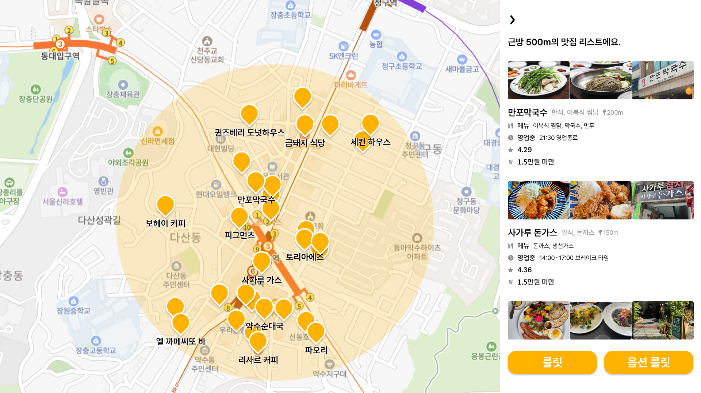
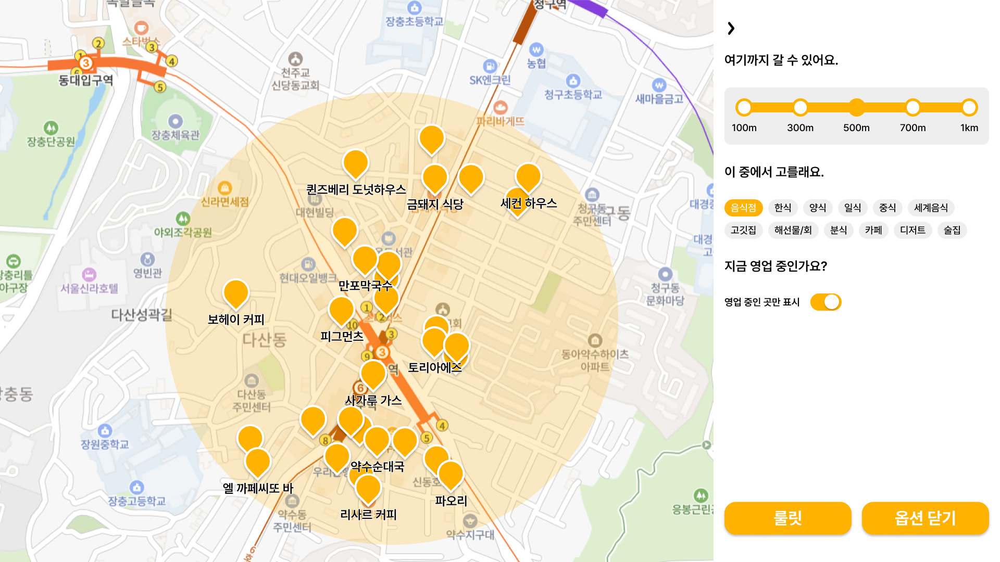
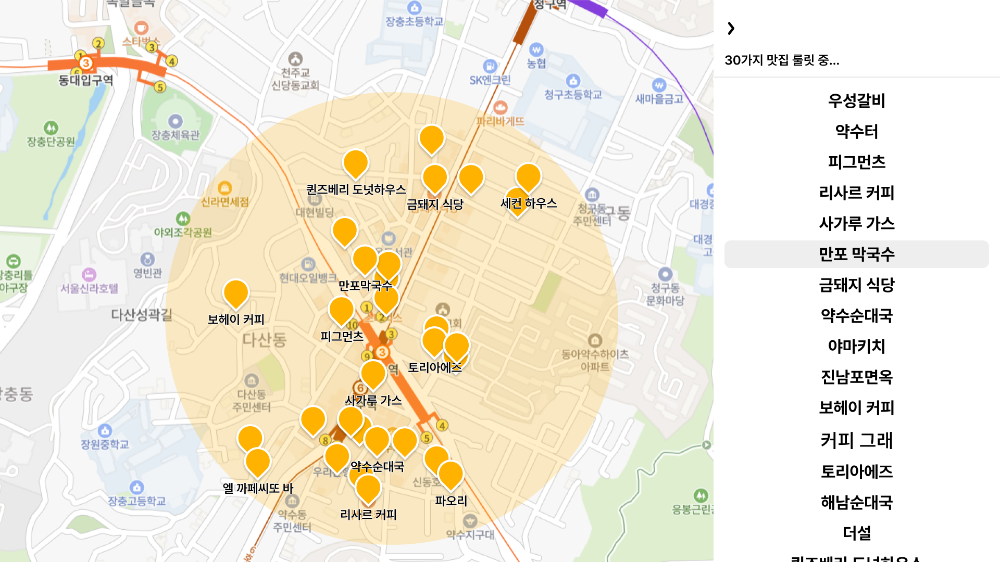

## 🤔 1차 기획 및 와이어프레임

`룰릿` 은 사용자의 위치에 기반하여 음식점을 `랜덤 추천` 해주는 서비스입니다.

`거리`, `제외할 메뉴`를 조건으로 설정하여 음식점을 조회할 수 있습니다.

 
 
 

 
 
 

 
 
 

 
 
 

## 👥 팀원

<table>
  <tr>
    <td align="center">
      <a href="https://github.com/rkdtmddnjs97">
        <b>rkdtmddnjs97</b>
      </a> 
      프론트엔드
    </td>
    <td align="center">
        <b>Kim Jun Young</b>
       디자이너
    </td>
    <td align="center">
      <a href="https://github.com/KimChanJin97">
        <b>KimChanJin97</b>
      </a> 
      백엔드
    </td>
  </tr>
</table>

 
 
 

## 🔗 관련 프로젝트

- [프론트엔드 리포지토리](https://github.com/KimAndKang/rouleatt-front)

 
 
 

## 🔖 기타 사항

`웹`, `모바일` 버전으로 출시할 계획입니다.